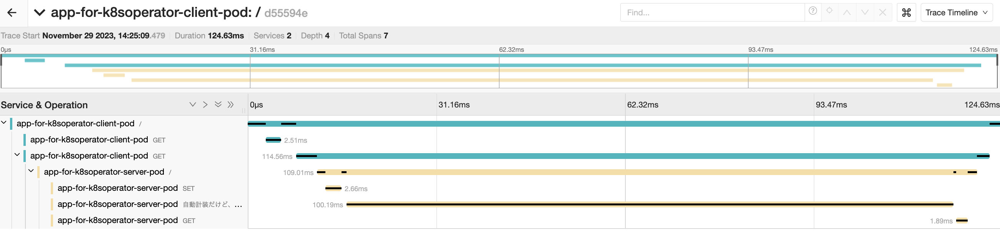

- Client
```sh
pip install 'flask<3' redis requests
```

- Server
```sh
pip install 'flask<3' redis
pip install opentelemetry-api
```
サーバー側では手動の Span を一つだけ生成した

- Instrumentation CRD
```sh
k get otelinst
NAME                 AGE    ENDPOINT                       SAMPLER                    SAMPLER ARG
my-instrumentation   102m   http://jaeger-collector:4318   parentbased_traceidratio   0.25
```

手動、挟んでも挟まなくても可能

